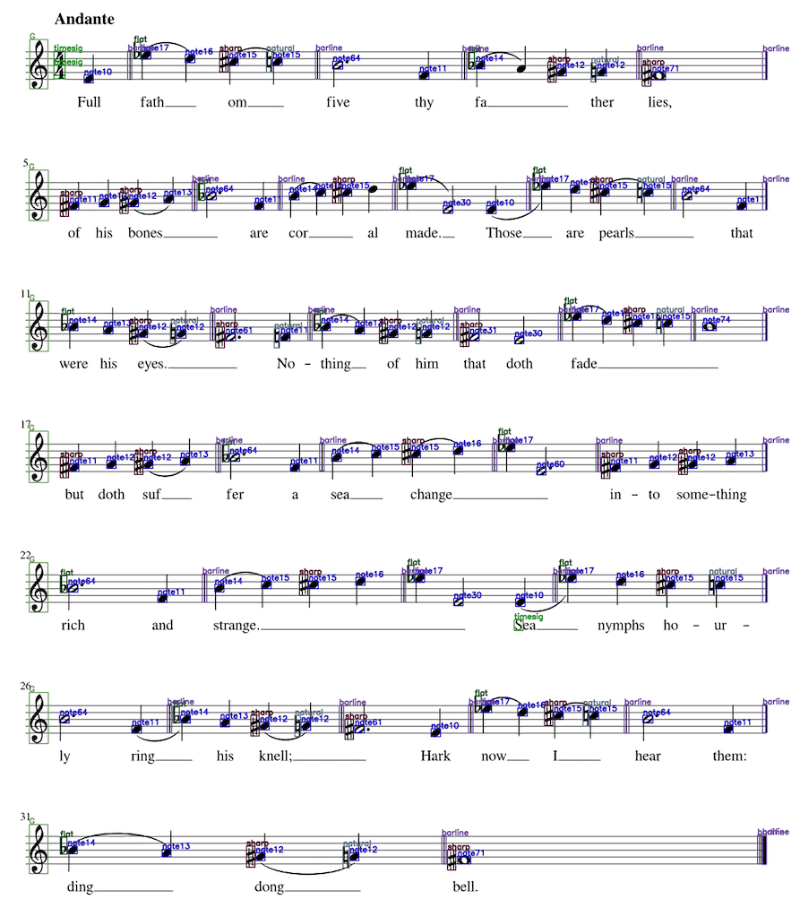
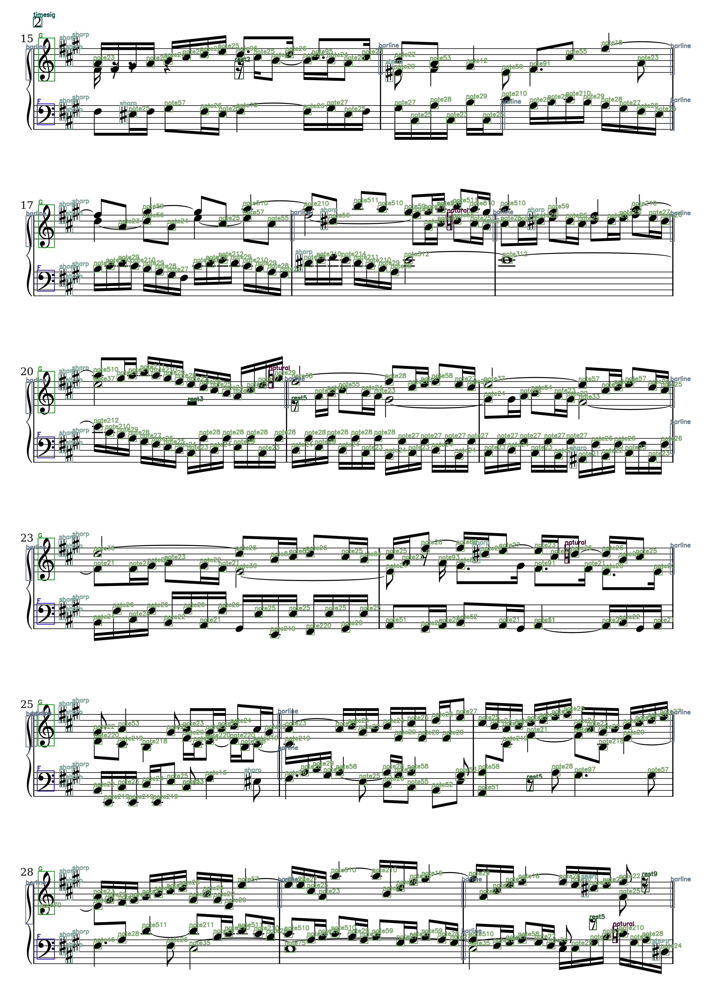

metric:

timesig:0.82

sharp:0.96

flat:0.93

natural:0.92

clefg: 0.98

clefG:0.96

clefc:0.86

barline:0.9

rest:0.92

note:0.94

slursegment:0.44

pitch_acc :0.92

duration_acc :0.963

----------

### TODO:
- [x] svg to png,get duration
- [x] get pitch
- [x] complicated music sheet

### 生成标签步骤
- 1.phantomjs 用svg生成txt. phantomjs/svg.js
- 2.通过svg生成乐谱图像。
- 3.在svg生成标签的基础上集合mxl，生成具有时值、音高的符号信息。pythontools/

